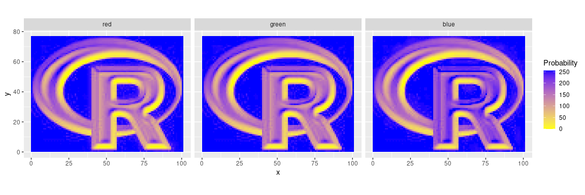
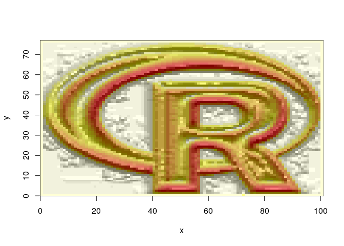

<!-- README.md is generated from README.Rmd. Please edit that file -->

# cartomisc

<!-- badges: start -->

[](https://github.com/statnmap/cartomisc/actions)
<!-- badges: end -->

The goal of {cartomisc} is to store a few useful functions for spatial
data manipulation and analysis.

## Installation

You can install the dev version on Github

``` r
# install.packages("remotes")
remotes::install_github("statnmap/cartomisc")
```

# Usage

``` r
library(dplyr)
library(raster)
library(cartomisc)
library(ggplot2)
library(sf)
```

## Extract part of the data with `gplot_data`

To draw multiple raster on the same ggplot2, or to draw raster after
other objects (points, polygons, lines)

  - data are extracted as a tibble
  - data can then be added to a ggplot2 with `geom_tile`

<!-- end list -->

``` r
# Read some data
slogo <- stack(system.file("external/rlogo.grd", package = "raster")) 
slogo
#> class      : RasterStack 
#> dimensions : 77, 101, 7777, 3  (nrow, ncol, ncell, nlayers)
#> resolution : 1, 1  (x, y)
#> extent     : 0, 101, 0, 77  (xmin, xmax, ymin, ymax)
#> crs        : +proj=merc +datum=WGS84 +ellps=WGS84 +towgs84=0,0,0 
#> names      : red, green, blue 
#> min values :   0,     0,    0 
#> max values : 255,   255,  255

# Get partial raster data to plot in ggplot
r.gg <- gplot_data(slogo)

# Remove NA to reduce size of table
r.gg.nona <- r.gg %>% 
  filter(!is.na(value))

r.gg.nona
#> # A tibble: 23,331 x 4
#>        x     y value variable
#>    <dbl> <dbl> <dbl> <fct>   
#>  1   0.5  76.5   255 red     
#>  2   1.5  76.5   255 red     
#>  3   2.5  76.5   255 red     
#>  4   3.5  76.5   255 red     
#>  5   4.5  76.5   255 red     
#>  6   5.5  76.5   255 red     
#>  7   6.5  76.5   255 red     
#>  8   7.5  76.5   255 red     
#>  9   8.5  76.5   255 red     
#> 10   9.5  76.5   255 red     
#> # … with 23,321 more rows
```

### Plot with ggplot2

``` r
# Plot
ggplot(r.gg.nona) +
  geom_tile(aes(x = x, y = y, fill = value)) +
  scale_fill_gradient("Probability", low = 'yellow', high = 'blue') +
  facet_wrap(vars(variable)) +
  coord_equal()
```



## Sun position

Calculate sun position for hillShade

``` r
sun_position <- sun_position(2019, 04, 26,
  hour = 12, min = 0, sec = 0,
  lat = 46.5, long = 6.5
)
sun_position
#> $elevation
#> [1] 56.48539
#> 
#> $azimuth
#> [1] 192.4585
```

Use with hillShade

``` r
r <- raster(system.file("external/rlogo.grd", package = "raster"))
# slope and aspect
r_slope <- terrain(r, opt = "slope")
r_aspect <- terrain(r, opt = "aspect")
# hillshade
r_hillshade <- hillShade(r_slope, r_aspect, angle = sun_position$elevation, direction = sun_position$azimuth)
# plot
image(r)
image(r_hillshade, col = grey(seq(0, 1, 0.1), alpha = 0.5), add = TRUE)
```



## Create buffer areas with attribute of the closest region

  - Download some data

<!-- end list -->

``` r
# Define where to save the dataset
extraWD <- tempdir()
# Get some data available to anyone
if (!file.exists(file.path(extraWD, "departement.zip"))) {
  githubURL <- "https://github.com/statnmap/blog_tips/raw/master/2018-07-14-introduction-to-mapping-with-sf-and-co/data/departement.zip"
  download.file(githubURL, file.path(extraWD, "departement.zip"))
  unzip(file.path(extraWD, "departement.zip"), exdir = extraWD)
}
```

  - Reduce the dataset to a small region

<!-- end list -->

``` r
departements_l93 <- read_sf(dsn = extraWD, layer = "DEPARTEMENT")

# Reduce dataset
bretagne_l93 <- departements_l93 %>%
  filter(NOM_REG == "BRETAGNE")
```

  - Calculate the regional buffer area using `regional_seas()`

<!-- end list -->

``` r
bretagne_regional_2km_l93 <- regional_seas(
  x = bretagne_l93,
  group = "NOM_DEPT",
  dist = units::set_units(30, km), # buffer distance
  density = units::set_units(0.5, 1/km) # density of points (the higher, the more precise the region attribution)
)
```

  - Plot the data

<!-- end list -->

``` r
ggplot() + 
  geom_sf(data = bretagne_regional_2km_l93,
          aes(colour = NOM_DEPT, fill = NOM_DEPT),
          alpha = 0.25) +
  geom_sf(data = bretagne_l93,
          aes(fill = NOM_DEPT),
          colour = "grey20",
          alpha = 0.5) +
  scale_fill_viridis_d() +
  scale_color_viridis_d() +
  theme_bw()
```


